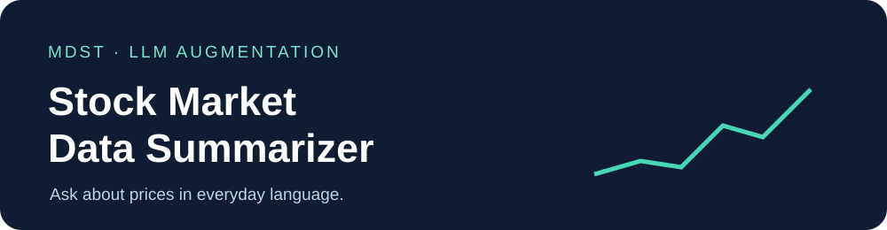

<p align="center">
  
</p>

# Stock Market Data Summarizer

**Ask about a stock in everyday language. Get a readable summary of recent closing prices.**

Stock Market Data Summarizer is a command-line prototype created for MDST's LLM Augmentation project. It is meant for students and people new to investing who may find financial sites, charts, and terminology overwhelming. Instead of searching through a price table, a user enters a stock ticker and a question; the program retrieves daily prices and asks an LLM to summarize relevant closing-price records in plain language.

> **Project status:** The repository contains a CLI prototype in `main2.py`. A Streamlit chatbot was the original interface goal, but it was not completed.

## Contents

- [Quickstart](#quickstart)
- [How it works](#how-it-works)
- [Features](#features)
- [Example session](#example-session)
- [FAQ](#faq)
- [Credits](#credits)

## Quickstart

You will need Python 3, an [Alpha Vantage API key](https://www.alphavantage.co/support/#api-key), an [OpenAI API key](https://platform.openai.com/api-keys), and a reachable TLS-enabled MongoDB deployment (such as MongoDB Atlas). API access and database availability are required for a live run.

1. **Get the code and install dependencies.**

   ```bash
   git clone https://github.com/asawicke/llm-augmentation.git
   cd llm-augmentation
   python3 -m venv .venv
   source .venv/bin/activate
   python -m pip install -r requirements.txt 'openai<1'
   ```

   The script uses the pre-v1 OpenAI Python API, so the `openai<1` constraint is needed with the current unpinned `requirements.txt`. On Windows, activate the environment with `.venv\Scripts\activate` instead.

2. **Create a `.env` file in the repository root.** Replace the sample values with your own credentials and keep the file out of Git.

   ```dotenv
   OPENAI_API_KEY=your_openai_api_key
   ALPHA_VANTAGE_API_KEY=your_alpha_vantage_api_key
   MONGO_URI=your_tls_enabled_mongodb_connection_string
   ```

3. **Start the CLI.**

   ```bash
   python main2.py
   ```

   Type a question, then a ticker such as `AAPL`. Enter `exit` at the question prompt to quit. Run `main2.py`; `main.py` is a separate experiment and is not this tool's entry point.

## How it works

<p align="center">
  
</p>

For each question, the script fetches daily open, high, low, close, and volume records from Alpha Vantage and upserts them into MongoDB. It then looks at records from the last **30 calendar days**, turns their **closing prices** into short statements, and compares those statements with the question using embeddings and cosine similarity. Statements above the script's similarity threshold become context for the final summary.

<p align="center">
  
</p>

*The animation illustrates the data flow; it does not show a live API request. Silent, about 7 seconds.*

## Features

| Feature | What it contributes |
| --- | --- |
| Daily price retrieval | Pulls recent OHLCV records for the ticker from Alpha Vantage. |
| Stored price records | Upserts records into MongoDB for date queries; each new question still fetches data. |
| Question-aware selection | Embeds closing-price statements and the question, then filters by cosine similarity. |
| Plain-language output | Passes selected statements to an OpenAI chat model for a readable response. |

## Example session

The interface is a small terminal loop: ask a question, provide a ticker, read the summary, and repeat.

```text
--- Stock Market Data Summarizer ---
Enter your query (or 'exit' to quit): How has AAPL closed recently?
Enter the stock ticker symbol (e.g., AAPL): AAPL

Summary:
[A generated summary of relevant recent closing-price records]
```

The words and prices in a live answer depend on when you run it and on the API responses. The short clip below shows an **illustrative interaction with sample data**, not a live market feed.

<p align="center">
  
</p>

*Illustrative CLI interaction with sample data. Silent, about 7 seconds.*

## FAQ

**Is this investment advice?**  
The prototype is intended to summarize historical price records, not make trading recommendations. Verify the source data before acting on generated text.

**Why am I seeing an error instead of a summary?**  
Check that all three `.env` values are set, the MongoDB deployment is reachable, and Alpha Vantage has returned daily price data. API limits, missing recent records, or no statements passing the similarity threshold can also prevent a useful answer.

**Why install `openai<1`?**  
`main2.py` uses `openai.Embedding.create` and `openai.ChatCompletion.create`, which belong to the older Python SDK. The dependency file does not pin a version.

**Where is the Streamlit app?**  
The Streamlit interface was a goal, not a completed feature. The current interaction is through the CLI.

## Credits

Created for the [Michigan Data Science Team](https://github.com/MichiganDataScienceTeam) LLM Augmentation project by [Ashley Sawicke](https://github.com/asawicke) and [Raymond Xi Cao](https://github.com/Craymond0). Market data comes from [Alpha Vantage](https://www.alphavantage.co/); the summarization and embedding calls use [OpenAI](https://platform.openai.com/).
